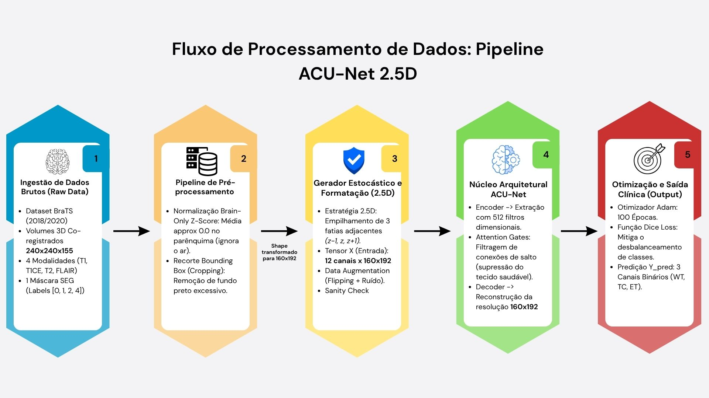

# Segmentação de Tumores Cerebrais em Ressonâncias Magnéticas Multimodais usando ACU-Net 2.5D

# Brain Tumor Segmentation in Multimodal Magnetic Resonance Imaging Using a 2.5D Attention-Based ACU-Net

> **Relatório final completo:** [assets/projeto_final_207726_298997.pdf](assets/projeto_final_207726_298997.pdf)

## Apresentação

O presente projeto foi originado no contexto das atividades da disciplina de pós-graduação *IA901 - Análise de Imagens e Reconhecimento de Padrões*, oferecida no primeiro semestre de 2026, na Unicamp, sob supervisão da Profa. Dra. Leticia Rittner, do Departamento de Engenharia de Computação e Automação (DCA) da Faculdade de Engenharia Elétrica e de Computação (FEEC).

> |Nome  | RA | Curso|
> |--|--|--|
> | Natália da Silva Guimarães  | 298997  | Mestrado em Engenharia Elétrica|
> | Oscar Eduardo Ortega Rodríguez  | 207726  | Mestrado em Engenharia Elétrica (Estudante Especial)|


## Descrição do Projeto

A segmentação manual de gliomas em exames de ressonância magnética multimodal é uma tarefa trabalhosa e sujeita à variabilidade entre diferentes especialistas. Este projeto propõe automatizar a segmentação de três sub-regiões tumorais relevantes: Tumor Inteiro (*Whole Tumor* — WT), Núcleo Tumoral (*Tumor Core* — TC) e Tumor Realçado (*Enhancing Tumor* — ET).

A solução utiliza as modalidades T1, T1CE, T2 e FLAIR do conjunto de dados BraTS, combinando informações complementares para localizar e delimitar o tumor. Embora os exames sejam volumes tridimensionais, a implementação adota uma estratégia 2.5D: para segmentar uma fatia central, o modelo também utiliza as fatias imediatamente anterior e posterior como contexto espacial.

A arquitetura proposta é uma ACU-Net 2.5D com mecanismo de atenção, capaz de reduzir a influência de regiões menos relevantes e enfatizar características associadas ao tumor. Essa abordagem busca equilibrar contexto tridimensional, precisão de segmentação e menor consumo de memória de GPU em comparação com arquiteturas totalmente 3D, contribuindo como ferramenta de apoio à análise neuro-oncológica.


## Metodologia


#### 1. Base de dados e organização dos pacientes

O projeto utiliza imagens de ressonância magnética multimodal dos conjuntos **BraTS 2018** e **BraTS 2020**. Para cada paciente, são utilizadas quatro modalidades de imagem:

* **T1:** representação anatômica do cérebro;
* **T1CE:** imagem T1 com contraste;
* **T2:** modalidade sensível a líquidos e alterações teciduais;
* **FLAIR:** modalidade útil para evidenciar edema e regiões anormais.

Cada paciente também possui uma máscara de referência denominada `SEG`, produzida por especialistas, que indica as regiões tumorais.

Os pacientes dos dois datasets são combinados, embaralhados com `seed = 42` e divididos em:

```text
80% para treinamento
20% para validação
```

O carregamento dos volumes ocorre sob demanda, ou seja, um paciente é processado por vez. Essa estratégia reduz o consumo de memória RAM.

---

#### 2. Normalização das imagens

Cada modalidade de ressonância passa por normalização estatística utilizando o método **Brain-Only Z-Score**.

Inicialmente, os voxels com valor igual a zero são ignorados, pois normalmente representam o fundo preto da imagem. Em seguida, a média e o desvio padrão são calculados apenas nos voxels pertencentes ao cérebro.

A normalização é dada por:

$$
z = \frac{x - \mu}{\sigma}
$$

onde:

* $x$ representa a intensidade original do voxel;
* $\mu$ representa a média das intensidades cerebrais;
* $\sigma$ representa o desvio padrão das intensidades cerebrais.

Esse processo reduz diferenças de brilho entre pacientes e exames, tornando as imagens mais comparáveis para o modelo.

---

#### 3. Processamento das máscaras tumorais

A máscara original `SEG` possui rótulos que representam regiões diferentes do tumor. Esses rótulos são convertidos em três máscaras binárias independentes:

```text
WT — Whole Tumor
TC — Tumor Core
ET — Enhancing Tumor
```

A definição de cada classe é:

```text
WT = rótulos 1, 2 e 4
TC = rótulos 1 e 4
ET = rótulo 4
```

Assim, a máscara final possui três canais, permitindo que o modelo aprenda a segmentar simultaneamente o tumor completo, o núcleo tumoral e a região realçada por contraste.

---

#### 4. Estratégia 2.5D

Embora os exames sejam volumes tridimensionais, o projeto utiliza uma abordagem **2.5D**.

Para prever a segmentação de uma fatia central $z$, são utilizadas três fatias consecutivas:

```text
z - 1
z
z + 1
```

Cada fatia contém quatro modalidades de ressonância:

```text
T1, T1CE, T2 e FLAIR
```

Portanto, a entrada do modelo possui:

```text
3 fatias × 4 modalidades = 12 canais
```

A máscara-alvo corresponde apenas à fatia central. Dessa forma, o modelo recebe contexto espacial das fatias vizinhas sem exigir o alto consumo de memória de uma arquitetura totalmente 3D.

Nas primeiras e últimas fatias do volume, onde uma fatia vizinha não existe, é aplicado *zero-padding*.

---

#### 5. Recorte anatômico

Após a preparação dos lotes, é aplicado um recorte central nas imagens e máscaras.

```text
Dimensão original: 240 × 240
Dimensão após recorte: 160 × 192
```

O objetivo é remover parte do fundo preto ao redor do cérebro, reduzir o custo computacional e concentrar o processamento na região anatômica mais relevante.

---

#### 6. Aumento de dados

Durante o treinamento, são aplicadas transformações para aumentar artificialmente a diversidade dos dados.

As transformações incluem:

* espelhamento horizontal;
* espelhamento vertical;
* adição de ruído gaussiano nas imagens de ressonância.

Os espelhamentos são aplicados tanto às imagens quanto às máscaras, mantendo o alinhamento entre o cérebro e as regiões tumorais.

O ruído gaussiano é aplicado apenas às imagens de entrada, pois a máscara médica deve permanecer inalterada.

Essas técnicas ajudam a reduzir o risco de sobreajuste e tornam o modelo mais robusto a pequenas variações nos exames.

---

#### 7. Arquitetura ACU-Net 2.5D

A arquitetura utilizada é uma **Attention-based Convolutional U-Net (ACU-Net)** implementada em PyTorch.

A rede recebe lotes com o seguinte formato:

```text
(Batch, 12, 160, 192)
```

onde:

```text
12 canais = 3 fatias consecutivas × 4 modalidades
```

A saída possui três canais:

```text
(Batch, 3, 160, 192)
```

correspondentes às classes WT, TC e ET.

O encoder da rede possui blocos `DoubleConv`, compostos por:

```text
Convolução 3 × 3
Batch Normalization
ReLU
Convolução 3 × 3
Batch Normalization
ReLU
```

Durante o encoder, a resolução espacial é reduzida por operações de `MaxPool2d`, enquanto o número de filtros aumenta progressivamente.

No decoder, convoluções transpostas restauram a resolução espacial. As conexões entre encoder e decoder são realizadas por *skip connections*.

Antes da concatenação, as informações vindas do encoder passam por **Attention Gates**, que ajudam a rede a reduzir informações irrelevantes e enfatizar regiões potencialmente associadas ao tumor.

---

#### 8. Treinamento

O treinamento utiliza um gerador global que seleciona pacientes, processa seus volumes e produz lotes 2.5D sob demanda.

Os principais parâmetros utilizados são:

| Parâmetro           |                       Valor |
| ------------------- | --------------------------: |
| Tamanho do lote     |                           8 |
| Lotes por paciente  |                           5 |
| Passos por época    |                         100 |
| Número de épocas    |                         100 |
| Otimizador          |                        Adam |
| Taxa de aprendizado |          $5 \times 10^{-5}$ |
| Função de perda     |                   Dice Loss |
| Dispositivo         | GPU CUDA, quando disponível |

A cada passo de treinamento, o modelo recebe um lote de imagens, gera a segmentação das três regiões tumorais e compara sua saída com a máscara médica correta.

Os pesos da rede são atualizados por retropropagação, utilizando o otimizador Adam.

---

#### 9. Função de perda

A função de perda utilizada é a **Dice Loss**, baseada na sobreposição entre a máscara prevista e a máscara real.

$$
Dice = \frac{2TP}{2TP + FP + FN}
$$

A Dice Loss é definida como:

$$
DiceLoss = 1 - Dice
$$

Essa métrica é adequada para segmentação tumoral porque o tumor ocupa apenas uma pequena parte da imagem. Portanto, métricas tradicionais de acurácia poderiam apresentar valores altos apenas por identificar corretamente o fundo.

---

#### 10. Avaliação do modelo

Após o treinamento, um paciente pertencente ao conjunto de validação é selecionado para inferência.

O modelo recebe as imagens processadas e produz máscaras para:

```text
WT — Whole Tumor
TC — Tumor Core
ET — Enhancing Tumor
```

As previsões são comparadas com a máscara médica de referência por meio de:

* Dice Score geral;
* Dice Score por classe;
* matrizes de confusão pixel a pixel;
* verdadeiros positivos;
* falsos positivos;
* falsos negativos;
* verdadeiros negativos.

Além das métricas quantitativas, as máscaras previstas são sobrepostas à modalidade FLAIR para permitir uma avaliação visual da localização e da extensão das regiões tumorais.


## Bases de Dados e Evolução

| Base de Dados | Endereço na Web | Características | Evolução e papel no projeto |
| ------------- | -------------------------------------------------- | ----------------------------------------------------------------------------------------------------------------------------------------------------------------------------------------------------------------------------------------------------------------------------------- | ----------------------------------------------------------------------------------------------------------------------------------- |
| BraTS 2018    | [MICCAI BraTS](http://braintumorsegmentation.org/) | Base de referência para segmentação de gliomas, composta por imagens de ressonância magnética multimodal (**T1, T1CE, T2 e FLAIR**) e máscara clínica `SEG`. Inclui casos de gliomas de alto grau (HGG) e baixo grau (LGG), com volumes padronizados em **240 × 240 × 155** voxels. | Fornece uma base consolidada para o treinamento e a validação do modelo, permitindo aprender a segmentação das regiões WT, TC e ET. |
| BraTS 2020    | [MICCAI BraTS](http://braintumorsegmentation.org/) | Versão posterior do desafio BraTS, mantendo as modalidades **T1, T1CE, T2 e FLAIR** e as anotações das regiões tumorais. Amplia a diversidade de casos e condições de aquisição.                                                                                                    | Complementa a BraTS 2018 ao aumentar a variabilidade dos pacientes, favorecendo maior capacidade de generalização da ACU-Net 2.5D.  |

Os pacientes das bases BraTS 2018 e BraTS 2020 são combinados e embaralhados antes da divisão experimental. A separação é realizada por paciente, com:

- 80% dos pacientes para treinamento
- 20% dos pacientes para validação

## Ferramentas

- **Python:** linguagem principal utilizada em todas as etapas do projeto, incluindo carregamento dos dados, pré-processamento, treinamento, avaliação e visualização dos resultados.

- **Google Colab:** ambiente computacional utilizado para execução do notebook, armazenamento temporário dos datasets e acesso acelerado por GPU quando disponível.
Kaggle API: utilizada para realizar o download automatizado dos conjuntos BraTS 2018 e BraTS 2020.

- **PyTorch:** framework empregado na implementação da arquitetura ACU-Net 2.5D, criação de tensores, execução das convoluções, gerenciamento automático de gradientes, retropropagação, uso do otimizador Adam e treinamento em GPU via CUDA.

- **SimpleITK:** biblioteca utilizada para demonstrar a aplicação do N4 Bias Field Correction, técnica de correção de variações artificiais de intensidade causadas pelo campo magnético da ressonância. Essa etapa foi avaliada no pré-processamento, mas não foi integrada ao gerador oficial de treinamento.

- **NiBabel:** utilizada para leitura e manipulação dos exames médicos no formato NIfTI, como arquivos .nii e .nii.gz.

- **NumPy:** empregada na manipulação de arrays multidimensionais, normalização Z-score, criação de máscaras binárias, empilhamento das modalidades, construção da estratégia 2.5D, transposição de eixos, recorte anatômico e aumento de dados.

- **Matplotlib:** utilizada para auditoria visual das imagens de ressonância, histogramas, máscaras tumorais, curvas de aprendizado, comparações entre ground truth e predições da rede.

- **Pandas:** utilizada para organizar e exibir tabelas de métricas, incluindo Dice Score, verdadeiros positivos, falsos positivos, falsos negativos e verdadeiros negativos.

- **Seaborn:** utilizada para gerar mapas de calor das matrizes de confusão para as classes WT, TC e ET.

- **Scikit-learn:** utilizada especificamente para calcular as matrizes de confusão pixel a pixel por meio da função confusion_matrix.

- **OS, Glob e Random:** bibliotecas auxiliares utilizadas para localizar arquivos dos pacientes, percorrer diretórios, criar pastas, embaralhar pacientes e organizar a divisão entre treinamento e validação.

## Workflow



## Experimentos e Resultados

## Discussão

## Conclusão

Este trabalho apresentou a implementação de um pipeline para segmentação automática de tumores cerebrais em imagens de ressonância magnética multimodal das bases BraTS 2018 e BraTS 2020. O fluxo desenvolvido contempla o carregamento de volumes NIfTI, a normalização Brain-Only Z-Score, a transformação das máscaras clínicas SEG nas regiões Whole Tumor (WT), Tumor Core (TC) e Enhancing Tumor (ET), a geração de entradas 2.5D e o treinamento de uma arquitetura ACU-Net implementada em PyTorch.

A adoção da estratégia 2.5D permitiu utilizar informações espaciais de fatias vizinhas, combinando as modalidades T1, T1CE, T2 e FLAIR em uma entrada de 12 canais. Essa abordagem representa um compromisso entre o uso de contexto tridimensional e a redução do consumo de memória computacional, tornando o treinamento mais viável em ambientes com recursos limitados.

A arquitetura ACU-Net combinou blocos convolucionais, conexões de atalho e Attention Gates. Os mecanismos de atenção foram empregados para filtrar informações menos relevantes nas skip connections e favorecer características relacionadas às regiões tumorais, auxiliando o decoder na reconstrução das máscaras WT, TC e ET.

A utilização da Dice Loss mostrou-se adequada para o problema, pois as regiões tumorais ocupam uma parcela reduzida da imagem quando comparadas ao fundo e ao tecido cerebral saudável. Dessa forma, a função de perda privilegia a sobreposição entre a predição e a máscara clínica, sendo mais apropriada que métricas simples de acurácia para tarefas de segmentação médica.

Apesar dos avanços, o projeto possui limitações. A avaliação ainda deve ser ampliada para todos os pacientes do conjunto de validação, com métricas por classe e análise mais robusta da generalização. Além disso, a etapa de aumento de dados precisa ser validada cuidadosamente para garantir que os espelhamentos ocorram apenas nos eixos espaciais, sem alterar a ordem das modalidades ou das classes tumorais.

Conclui-se que a implementação desenvolvida demonstra a viabilidade de uma ACU-Net 2.5D para segmentação de tumores cerebrais em MRI multimodal. O modelo deve ser compreendido como uma ferramenta experimental de apoio à análise de imagens médicas, sendo necessários estudos adicionais, validação externa e comparação com outras arquiteturas antes de qualquer utilização em contexto clínico.

**Sobre a modelagem em 3D inicial:**

Inicialmente, o projeto previa a continuidade da modelagem em 3D, incluindo ajuste de limiares e técnicas de pós-processamento para redução de falsos positivos, treinamento com maior número de épocas e lotes, validação cruzada entre as bases BraTS 2018 e BraTS 2020 e visualizações tridimensionais integrando as imagens de ressonância, as máscaras médicas e as predições do modelo.

Entretanto, essas etapas foram interrompidas devido às restrições de tempo disponíveis para execução do projeto e às limitações computacionais do ambiente utilizado. O treinamento de arquiteturas 3D demanda maior capacidade de memória GPU, processamento e tempo de execução, especialmente ao utilizar volumes completos de ressonância magnética e múltiplas modalidades por paciente.

Dessa forma, optou-se pela estratégia 2.5D, que preserva parte do contexto espacial entre fatias vizinhas e reduz significativamente o consumo de memória em comparação com convoluções totalmente 3D. As etapas não concluídas permanecem como possibilidades de evolução futura do projeto.

## Trabalhos Futuros

A continuidade do projeto pode envolver melhorias no pré-processamento, na estratégia de treinamento, na avaliação experimental e na arquitetura empregada. As principais possibilidades são apresentadas a seguir.

#### 1. Correção e aperfeiçoamento do aumento de dados

Uma melhoria imediata consiste em revisar o procedimento de aumento de dados. No formato utilizado antes da transposição para PyTorch, os lotes possuem a estrutura:

```text
(Batch, Altura, Largura, Canais)
```

Portanto, os espelhamentos devem ocorrer apenas nos eixos espaciais de altura e largura. O uso de `axis=-1` pode inverter a ordem dos canais, alterando incorretamente as modalidades T1, T1CE, T2 e FLAIR ou as classes WT, TC e ET.

Após essa correção, podem ser avaliadas novas transformações, como rotações leves, zoom, deformações elásticas e ajustes de contraste, desde que imagens e máscaras permaneçam alinhadas.

#### 2. Integração e avaliação do N4 Bias Field Correction

A correção N4 foi demonstrada no notebook por meio da biblioteca SimpleITK, mas não foi integrada ao pipeline oficial de treinamento.

Como trabalho futuro, pode-se criar uma comparação experimental entre:

```text
Treinamento apenas com Brain-Only Z-Score
vs.
Treinamento com N4 Bias Field Correction + Brain-Only Z-Score
```

Essa análise permitiria verificar se a correção de variações de intensidade melhora a segmentação das regiões WT, TC e ET.

#### 3. Amostragem balanceada de fatias tumorais

O gerador atual seleciona fatias ao longo do volume do paciente. Como muitas fatias não possuem tumor, o modelo pode receber grande quantidade de exemplos contendo apenas tecido saudável.

Uma evolução seria implementar uma estratégia de amostragem balanceada, garantindo maior presença de fatias com regiões tumorais durante o treinamento. Isso pode melhorar principalmente a identificação de regiões pequenas, como o tumor realçado (ET).

#### 4. Ajuste de hiperparâmetros

Podem ser realizados experimentos com diferentes configurações de treinamento, incluindo:

* tamanho do lote;
* taxa de aprendizado;
* número de épocas;
* passos por época;
* tamanho do recorte anatômico;
* número de fatias utilizadas na entrada 2.5D;
* quantidade de filtros da ACU-Net;
* intensidade e tipos de aumento de dados.

Esses testes podem ajudar a encontrar uma configuração com melhor equilíbrio entre desempenho, tempo de treinamento e consumo de memória.

#### 5. Comparação entre arquiteturas

A arquitetura atual utiliza uma ACU-Net 2.5D com Attention Gates. Como evolução, podem ser comparadas diferentes alternativas:

```text
U-Net 2D convencional
U-Net 2.5D sem Attention Gate
ACU-Net 2.5D com Attention Gate
Arquitetura 3D completa, quando houver recursos computacionais suficientes
```

Essa comparação permitiria medir a contribuição real da estratégia 2.5D e dos mecanismos de atenção.

#### 6. Avaliação mais robusta

Atualmente, a avaliação visual utiliza pacientes do conjunto de validação e fatias contendo tumor. Como trabalho futuro, recomenda-se avaliar sistematicamente todos os pacientes do conjunto de validação, considerando todas as fatias relevantes.

Também podem ser adicionadas métricas complementares:

* Dice Score por classe;
* sensibilidade;
* precisão;
* especificidade;
* Hausdorff Distance 95% (HD95);
* volume tumoral previsto;
* intervalo de confiança das métricas.

Além disso, a validação cruzada por paciente pode fornecer uma análise mais robusta da estabilidade do modelo.

#### 7. Avaliação entre BraTS 2018 e BraTS 2020

Uma possibilidade importante é testar a capacidade de generalização entre bases. Por exemplo:

```text
Treinar com BraTS 2018 e validar com BraTS 2020
Treinar com BraTS 2020 e validar com BraTS 2018
Treinar com ambas as bases e avaliar separadamente cada uma
```

Essa análise ajudaria a identificar se o modelo mantém desempenho diante de diferentes pacientes, *scanners* e condições de aquisição.

#### 8. Pós-processamento das máscaras previstas

Após a inferência, podem ser aplicadas técnicas para reduzir falsos positivos, como:

* remoção de pequenas regiões isoladas;
* análise de componentes conectados;
* ajuste do limiar de decisão;
* imposição de consistência entre WT, TC e ET.

Como as regiões possuem relação hierárquica, uma restrição útil seria garantir que:

```text
ET esteja contido em TC
TC esteja contido em WT
```

Isso pode tornar as máscaras previstas mais coerentes.

#### 9. Interpretabilidade do modelo

Outra evolução seria gerar mapas de atenção e visualizações que mostrem quais regiões foram mais relevantes para a decisão da ACU-Net.

Essas visualizações podem ajudar a analisar:

* onde os Attention Gates concentraram atenção;
* quais áreas influenciaram a previsão;
* quando o modelo confundiu tecido saudável com tumor;
* quais modalidades foram mais úteis em determinadas regiões.

#### 10. Reprodutibilidade experimental

Para aumentar a confiabilidade do estudo, recomenda-se:

* fixar sementes do Python, NumPy e PyTorch;
* registrar as versões das bibliotecas;
* salvar a lista de pacientes de treino e validação;
* salvar pesos finais e *checkpoints*;
* registrar métricas por época;
* disponibilizar um arquivo `requirements.txt`;
* documentar configurações de GPU e CUDA.

#### 11. Aplicação clínica e validação externa

Por fim, uma etapa futura mais avançada seria avaliar o modelo em dados externos aos conjuntos BraTS. Essa etapa permitiria verificar se a arquitetura mantém desempenho em exames de outras instituições, *scanners* e protocolos de aquisição.

Entretanto, essa validação deve ser conduzida com bases independentes e acompanhamento de especialistas, pois o modelo atual deve ser entendido como uma ferramenta experimental de apoio à análise de imagens médicas, e não como substituto da avaliação clínica.


## Uso de IA Generativa

Utilizamos ChatGPT para:

- Elaborar explicações e interpretações dos resultados, comparando métricas do modelo com as do artigo original.

- Apoiar a exploração inicial de uma arquitetura 3D baseada em U-Net com atenção. Essa proposta serviu como referência conceitual, mas não foi incorporada à implementação final devido às limitações computacionais associadas ao processamento de volumes completos em 3D.

- Prompt exemplo: “Crie um modelo de segmentação 3D para tumores cerebrais usando Keras/TensorFlow. O modelo deve ser baseado em U-Net com atenção (ACU-Net), receber 4 modalidades de imagem (FLAIR, T1, T1CE, T2) com tamanho 128x128x64, e gerar 3 classes de saída (WT, TC, ET). Inclua: camadas Conv3D, BatchNormalization, MaxPooling3D, Dropout, Attention, Conv3DTranspose e concatenations necessárias. Mostre o resumo completo do modelo (model.summary()).”

Utilizamos o Gemini para:

- Desconstruir o fluxo matemático da rede ACU-Net e traduzir sua lógica orientada a objetos para o PyTorch (criando os módulos `DoubleConv` e `AttentionGate`).
- Estruturar o rigor do pré-processamento focado na remoção de viés magnético (N4 Bias Correction via SimpleITK).

## Referências
[1] Zhou, Z., Rahman Siddiquee, M. M., Tajbakhsh, N., Liang, J. UNet++: A Nested U-Net Architecture for Medical Image Segmentation. Deep Learning in Medical Image Analysis, 2018.
[2] Zhang, Z., Liu, Q., Wang, Y. Road Extraction by Deep Residual U-Net. IEEE Geoscience and Remote Sensing Letters, 2018. (inspiração para skip connections e atenção)
[3] Oktay, O., Schlemper, J., Folgoc, L. L., et al. Attention U-Net: Learning Where to Look for the Pancreas. arXiv:1804.03999, 2018.
[4] Talukder, M. A., et al. ACU-Net: Attention-based Convolutional U-Net model for segmenting brain tumors in fMRI images. Expert Systems with Applications, 2025.
[5] B. H. Menze, A. Jakab, S. Bauer, J. Kalpathy-Cramer, K. Farahani, J. Kirby, et al. "The Multimodal Brain Tumor Image Segmentation Benchmark (BRATS)", IEEE Transactions on Medical Imaging 34(10), 1993-2024 (2015) DOI: 10.1109/TMI.2014.2377694
[6] S. Bakas, H. Akbari, A. Sotiras, M. Bilello, M. Rozycki, J.S. Kirby, et al., "Advancing The Cancer Genome Atlas glioma MRI collections with expert segmentation labels and radiomic features", Nature Scientific Data, 4:170117 (2017) DOI: 10.1038/sdata.2017.117
[7] S. Bakas, M. Reyes, A. Jakab, S. Bauer, M. Rempfler, A. Crimi, et al., "Identifying the Best Machine Learning Algorithms for Brain Tumor Segmentation, Progression Assessment, and Overall Survival Prediction in the BRATS Challenge", arXiv preprint arXiv:1811.02629 (2018)